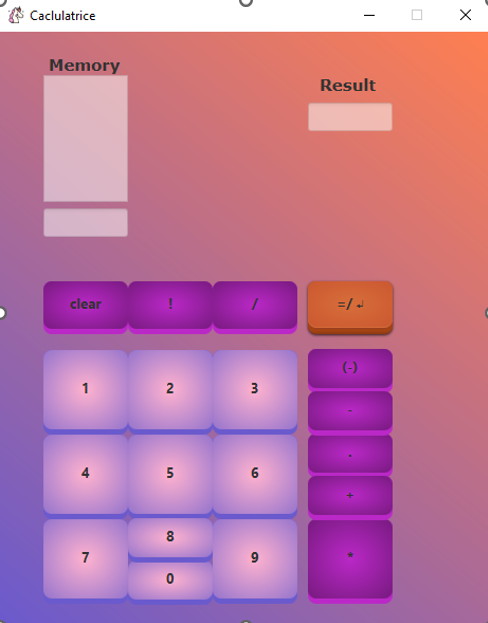

# Inverse Polish Calculator (MVC) in JavaFX

This project is an Inverse Polish Notation (RPN) calculator implemented using the Model-View-Controller (MVC) architectural pattern with JavaFX and OpenJDK 19.

## Table of Contents

1. [Project Overview](#project-overview)
2. [Prerequisites](#prerequisites)
3. [Installation](#installation)
4. [Usage](#usage)

## Project Overview

The Inverse Polish Calculator (MVC) is a calculator application that uses Reverse Polish Notation (RPN) and follows the Model-View-Controller (MVC) design pattern. It provides a user-friendly interface for performing mathematical operations.

## Prerequisites

To run this project, you will need the following:

- OpenJDK 19 or a later version
- Maven (for dependency management)

## Installation

1. Clone this repository to your local computer using the following command:
   ```shell
   git clone https://github.com/your-username/Inverse_Polish_calculator_MVC.git
2. cd Inverse_Polish_calculator_MVC
3. mvn clean javafx:run
   
## Usage
Once the calculator is launched, you can perform the following operations:

Enter numbers and operators using the calculator buttons.
Use Reverse Polish Notation (RPN) for complex operations.
Press the "Calculate" button to obtain the result.
The "Clear" button allows you to clear the display.
You can also use keyboard keys to enter numbers and operators (+, -, *, /).


